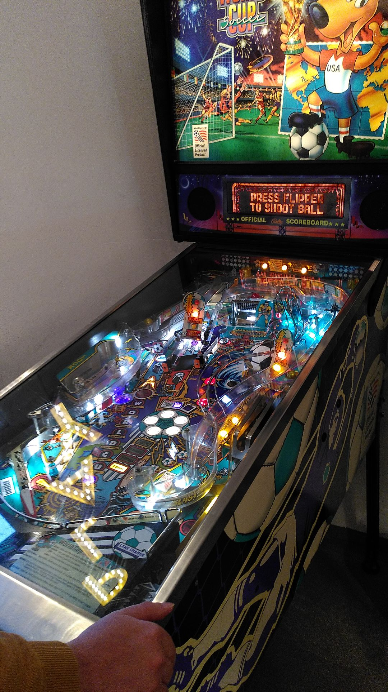

## Table of contents

- [TLDR:](#tldr)
- [Introduction](#introduction)
- [Attendance](#attendance)
- [Financial Recap and Goals for 2025](#financial-recap-and-goals-for-2025)
- [Auditing](#auditing)
- [Statue Amendments](#statue-amendments)
  - [Change of Function Periods](#change-of-function-periods)
  - [Change of Membership Fees](#change-of-membership-fees)
- [Election of the Board & Auditors](#election-of-the-board--auditors)
- [Open Discussion](#open-discussion)
  - [Emergency Strategy](#emergency-strategy)
  - [Services](#services)
    - [LLM Chat Bot](#llm-chat-bot)
    - ["Coffee Machine" Gaming Server](#coffee-machine-gaming-server)
    - [Quackscape](#quackscape)
  - [Mechandise](#mechandise)
  - [Hackathon](#hackathon)
  - [Collaborations](#collaborations)
  - [Blog Posts](#blog-posts)
- [Conclusion](#conclusion)
- [Documents](#documents)

## TLDR:

- The general assembly was held on February 1st, 2025 in Vienna.
- The financial recap of 2024 was presented and the budget for 2025 was discussed.
- The audit was carried out and no objections were found.
- The function periods of the board members were extended to 18 months.
- Minimum membership fees were introduced.
- The board and auditors were elected.
- We discussed emergency strategies, services, merchandise, a hackathon, collaborations, and blog posts.
- We will host a hackathon on April 19th in Vienna.

## Introduction

It's been about a year since private.coffee is a registered association in Austria, so it was time for our first general assembly.
We held our general assembly on February 1st, 2025 in Vienna. After some introductory rounds of pinball and coffee in the office of [DIE ANTWORT](https://die-antwort.eu/) we were ready to start.

*ogalbnafets plays a round of pinball before the general assembly*

## Attendance

- kumi
- jupfi
- ogalbnafets
- noniq

Location: Die Antwort, Obere Weißgerberstraße 4, 1030 Vienna, Austria.

## Financial Recap and Goals for 2025

The general assembly started with some words from the chairperson kumi and the treasurer jupfi presented a recap of the financial year 2024.

*The 2024 financial year. Expenses were lower from March to May and increased due to a stronger database server which was added in summer. The expenses stayed quite constant over the last quarter of the year. Income due to memberships increased throughout the year.*

---

After the recap of 2024 we continued with budget goals for 2025, which mainly included reducing the dependence on corporate memberships and increasing the number of individual members.
Another goal for 2025 will be to have a small emergency fund to cover unexpected costs.

*The budget for 2025.The main goal is to decrease the dependence on corporate members while having constant expenses.*

## Auditing

Auditor ogalbnafets reported that the audit was carried out and no objections were found. He recommended that the actions of the Board be approved.

## Statute Amendments

Some changes to the statutes were necessary to clarify some points and reduce some administrative inconveniences.

### Change of Function Periods

To have an easier time with handling bank accounts, we extended the function periods of the board members to **18 months**. This change was unanimously accepted by the general assembly.

### Change of Membership Fees

Another point was the introduction of minimum membership fees.

- **Supporting members:** 5€/month or 50€/year
- **Regular members:** 10€/month or 100€/year
- **Corporate members:** 100€/month or 1000€/year

This change was also unanimously accepted by the general assembly.

## Election of the Board & Auditors

- **Chairperson:** Previous chairperson kumi was up for vote and was re-elected unanimously. The election was confirmed by the election committee (noniq, ogalbnafets).

- **Treasurer:** jupfi was up for vote and was re-elected unanimously. The election was confirmed by the election committee (noniq, ogalbnafets).

- **Audit:** In addition to ogalbnafets who was auditor in 2024, noniq was elected as a second auditor. The election was confirmed by the election committee (kumi, jupfi).

## Open Discussion

The open discussion covered a wide range of topics, including collaborations with other organization, emergency strategies, and services we want to provide in the future.

### Emergency Strategy

kumi is mainly responsible for the server administration right now and while there are already some emergency strategies in place, we want to improve on the documentation and actually have test runs for the emergency strategies.

One of the proposed strategies was to have a rescue account set up on the servers which can be used to access the servers in case of an emergency. This account would be set up with a private key which is shared among trusted members, requiring a certain number of members to be present to access the account.

### Services

#### LLM Chatbot ("CoffeeGPT")

The greatest interest was in a Private.coffee-hosted chatbot as an alternative to ChatGPT and other similar services for Large Language Models (LLM). We actually want to have the hardware on site (Private.coffee location) to host services like this.
We already have a server housing and servers for this purpose. However we will still need some SSDs and other auxiliary hardware.
jupfi will look into the hardware setup and electrical installation while kumi will look into the software setup. Right now the plan ist to host [Ollama models](https://ollama.com/) since we already have experience with hosting them.

Access to the service will be provided to members of Private.coffee so hopefully we'll see you there soon!

#### "Coffee Machine" Gaming Server

We already have [ongoing development](https://git.private.coffee/PrivateCoffee/coffeemachine) on a service for hosting a variety of game servers.

ogalbnafets proposed that we could rotate through different games and have a "game of the month" where we host a server for a specific game for a month. People could then join and play together, maybe with some fixed times for playing together. This would not have to be exclusive to members of Private.coffee.

#### Quackscape

In the past kumi and ogalbnafets were working on an online panoramic content management system called [Quackscape](https://git.private.coffee/PrivateCoffee/quackscape). Development has been on hold for a while but we want to pick it up again.

### Merchandise

The Private.coffee mugs were a great success and we want to continue with merchandise. Highest priority right now are stickers which people can pass around and put on their laptops.

Another important merchandise item would be t-shirts. We would like to have the designs embroidered on the shirts so they are more durable.

The final merchandise item we discussed are coffee-to-go cups.

ogalbnafets will look into the production of the different merchandise items.

### Hackathon

We want to host a hackathon in the future and already decided on a date: **April 19th in Vienna**. We have not yet decided on a topic but we will keep you updated. One idea that was proposed was to have a hackathon on the topic of hardware, since there are 3D printers and CNC mills available at the DIE ANTWORT office.

### Collaborations

noniq has a couple of contacts in the field of digital rights and privacy and we want to collaborate with them in the future. We don't have any concrete plans yet but we will keep you updated.
We also want to attend the [Grazer Linuxtage](https://www.linuxtage.at/) in April but probably only as visitors.

### Blog Posts

Kumi did great work on the website and we now have a [blog section](https://private.coffee/blog/) and we want to have more blog posts in the future. If you have any ideas or want to write a blog post yourself, please let us know! Right now we maybe want to introduce the different services we are hosting and give Private.coffee a face by introducing the people behind it.

## Conclusion

After the general assembly we had some more discussions at a nearby restaurant. We all agreed that the general assembly was lots of fun and we are looking forward to the next year.

---

## Documents

- You can find the protocol of the general assembly [here](documents/protocol_general_assembly_2025.pdf).

- Some statues were changed, you can find the official german text for the [change of function periods here](documents/0402_function-periods.md) and the [change of membership fees here](documents/0401_membership-fees.md).

- The slides that were presented at the general assembly can be found [here](documents/Private.coffee_slides.pdf).
